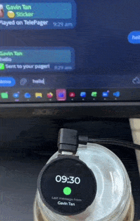
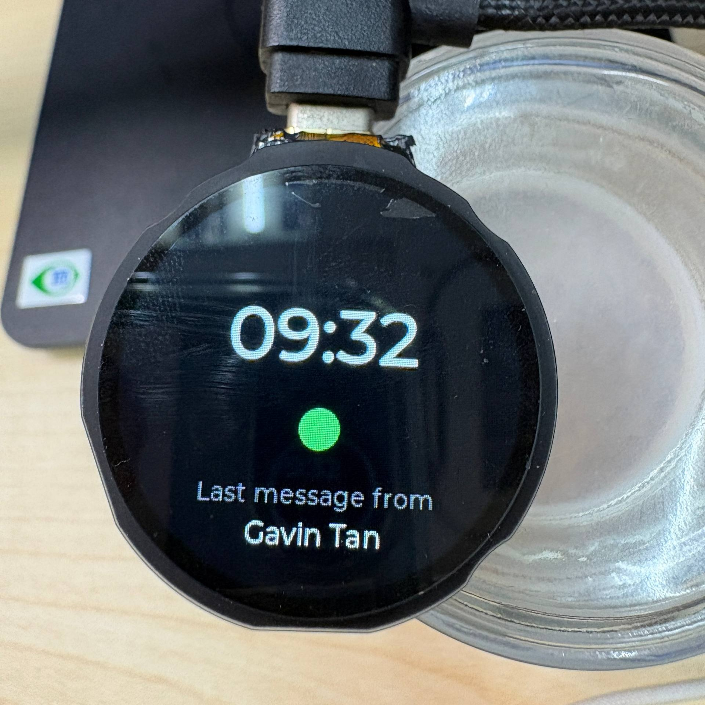
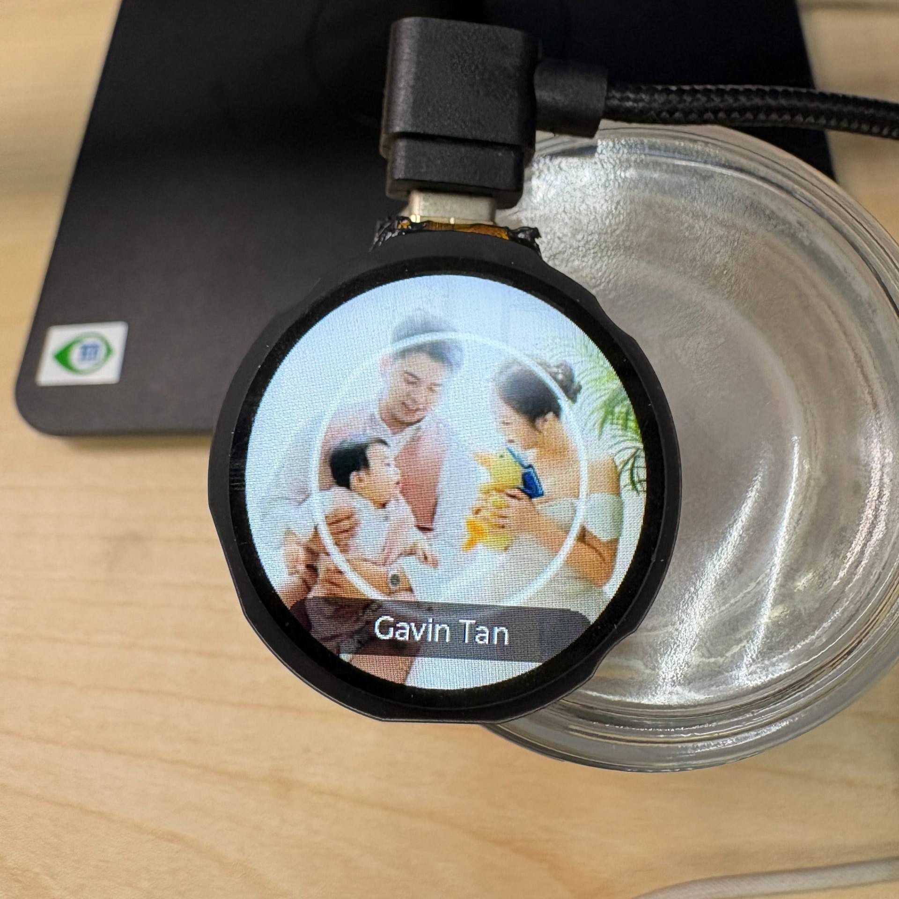
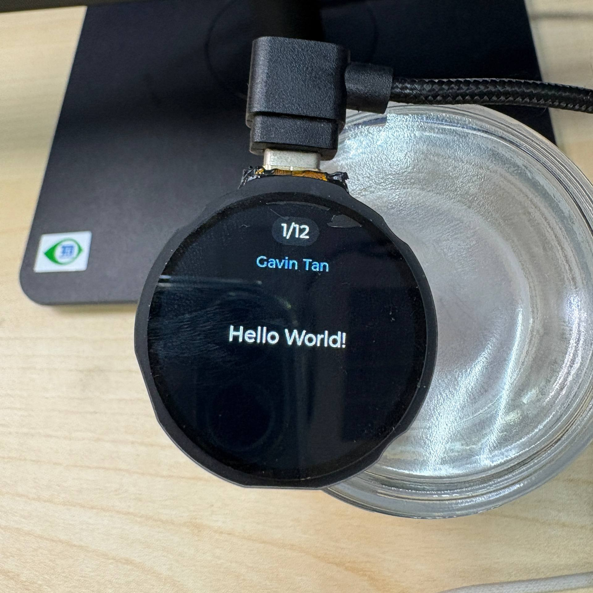

# BubblePager

**BubblePager** turns Telegram video notes into a physical, receive-only pager.
Send a round video bubble, a sticker, or a short text message to a Telegram bot,
and it shows up seconds later on a 240×240 round display — no send path, no
keyboard, no notifications feed to scroll through. Just messages arriving, one
at a time, like a real pager.

<p align="center">
  
</p>


> **New here? → [Setup guide (`SETUP.md`)](SETUP.md)** walks you through bot,
> Supabase, server, and firmware in ~20 minutes.

Built on an **ESP32-S3** driving a **GC9A01 round IPS display**, with a
self-hosted **Python/FastAPI** server bridging the **Telegram Bot API** to the
device over WiFi.

## Why

Telegram's circular video-note bubbles are a perfect shape match for a round
display. BubblePager leans into that: video notes, video/static stickers, and
short text messages are transcoded server-side into a lightweight MJPEG stream
and pushed to the device over Server-Sent Events, where they play back directly
on the round panel — filling the circle edge-to-edge.

## Features

- **Round video-note playback** — MJPEG streamed and decoded frame-by-frame
  directly onto the display, with a live progress ring and tap-to-pause.
- **Stickers** — static (WEBP) and video (WEBM) stickers both play; animated
  `.tgs` (Lottie) stickers are declined gracefully.
- **Text messages** — short Telegram texts render word-wrapped inside the
  round display's safe zone, capped and validated server-side.
- **Pager-style unread queue** — new arrivals pulse the sender's Telegram
  profile photo; ignore it and the display sleeps, badging an unread count for
  next time — just like a real pager, not a notification feed.
- **Reels-style catch-up reel** — tap to play missed messages in order, tap
  left/right to skip back and forth through the backlog.
- **History carousel** — browse past bubbles, stickers, and texts with
  buttons or touch swipes; long-press for sender/timestamp metadata.
- **Touch + button interaction model** — a capacitive touch ring and physical
  buttons drive identical navigation, so either input method works everywhere.
- **On-device settings** — WiFi/NTP sync, haptics, motion-wake, auto-rotate,
  and incoming-timeout, all in a touch-scrollable settings wheel.
- **Self-hosted, Docker-deployable server** — FastAPI + FFmpeg, runs on any
  always-on host (VPS, Raspberry Pi, free-tier cloud); no vendor lock-in.

## How it works

```
Telegram (video note / sticker / text)
        │
        ▼
  Python server (FastAPI + FFmpeg)
   • downloads + transcodes to 240×240 MJPEG
   • fetches the sender's avatar
   • pushes an event over Server-Sent Events
        │  WiFi
        ▼
  ESP32-S3 firmware
   • streams + decodes MJPEG straight to the round panel
   • drives the pulsing incoming screen, history, settings
```

## Hardware

<p align="center">
  
</p>

ESP32-S3 (N16R16) driving a GC9A01 240×240 round IPS panel over the I80
parallel bus, with capacitive touch, haptic feedback, a TCA6408 button
expander, a PCF85063 RTC, and a QMI8658 IMU for motion-wake and auto-rotate.

## Gallery

<p align="center">
  
  
</p>

## Project layout

| Path                 | What's in it                                              |
|-----------------------|-------------------------------------------------------------|
| [`BubblePager_firmware/`](BubblePager_firmware) | ESP32-S3 firmware (PlatformIO/Arduino, LVGL v9) |
| [`BubblePager_server/`](BubblePager_server)   | Telegram bot + transcoder + streaming API (Python/FastAPI) |

**Setup:** start with **[`SETUP.md`](SETUP.md)** for the full walkthrough.
**Using the device:** see **[`CONTROLS.md`](CONTROLS.md)** for buttons, touch
gestures, the unread reel, and settings. For deeper details see
`BubblePager_firmware/CLAUDE.md` (firmware/hardware) and
`BubblePager_server/README.md` (server + Docker deployment: VPS, Raspberry Pi,
or free-tier cloud).

## FAQ

| Question | Answer |
|----------|--------|
| **Why isn't the sender's profile picture showing?** | A Telegram privacy setting on the *sender's* side, not a bug. Bots can only fetch a photo if their **Settings → Privacy & Security → Profile Photos** is **Everybody**. Otherwise the pager falls back to the plain pulsing ring. |
| **How do I let other people send to my pager?** | Anyone can DM your bot a video-note out of the box. For a **shared group**: create a group, add the bot, then in [@BotFather](https://t.me/BotFather) run `/setprivacy` → your bot → **Disable**, and re-add the bot to the group. It then receives every member's messages, not just commands. |
| **What message types can it show?** | Round video-notes (primary), plus video/static stickers and short text messages. Animated `.tgs` (Lottie) stickers are declined gracefully. |
| **Nothing plays on the device.** | See the [Troubleshooting table in `SETUP.md`](SETUP.md#troubleshooting). Usual causes: device and server not on the same network, wrong `SERVER_HOST`/port, or phone-hotspot client isolation. |
| **Do I have to keep my PC on?** | For a laptop/desktop host, yes — only works while it's awake. For always-on use, run the server on a Raspberry Pi or free-tier cloud VM (see [`SETUP.md`](SETUP.md#3-server)). |

## Status

Personal project, actively developed. Firmware and server are both
functional end-to-end; hardware bring-up and real-world use are ongoing.

## License

[MIT](LICENSE) — do what you like, no warranty.
